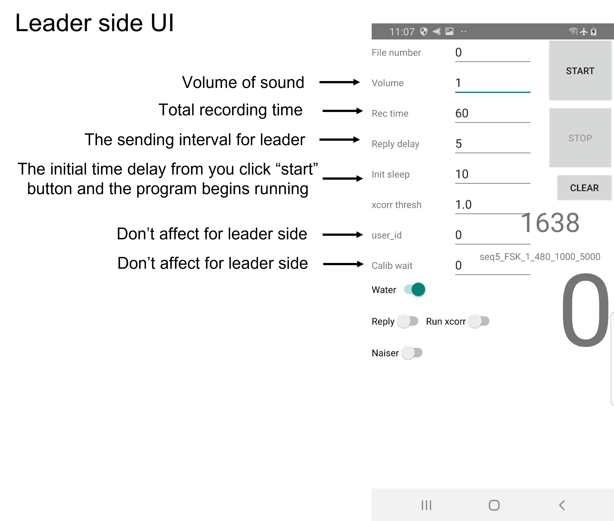
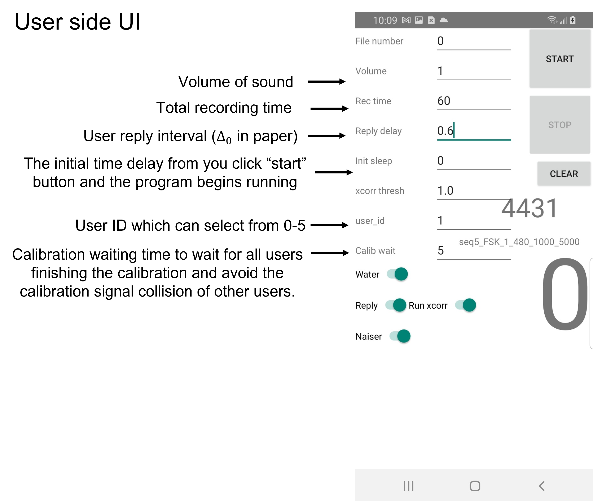

UnderwaterGPS APP
============
UnderwaterGPS APP is an Android application that plays and records sounds with the C++ OpenSLES API using JNI. This app is the implementation of our distributed underwater localization protocol. Currently, this App can perform our distributed localization protocol with the preamble exchanging among multiple devices and save the essential raw data to the disk. The localization algorithm part is deployed in the folder "Offline_Process".

# Pre-requisites

- Android Studio 2.2+ with [NDK](https://developer.android.com/ndk/) bundle.

# Code Structures
 ### fftw3/
 The library and source code for fftw library for Fourier Transform.

### gradle/
The configuration files for Android Studio

### app/src/main/
The source codes for main function of Android App 
### app/src/main/assets: 
It contain the background music file

### app/src/main/assets/java: 
Contain the Java codes for App. Under the folder "com\example\nativeaudio":
(1) Constants.java: contains the input parameters setup, default parameters and coding loading preamble from disk to App  
(2) MyTask.java: contains the main function `def work()`, which is the start of the entire Java program and it calls the function `NativeAudio.calibrate()` from c++ files (`Java_com_example_nativeaudio_NativeAudio_calibrate()` in c++ files). 
(3) NativeAudio.java: Enable the functionalities of text box, scroll, button, IMU sensor.  

### app/src/main/assets/res: 
Folder "layout" contains the UI configuration of the App; Folder "raw" contains the sending preamble files in .bin format. 

### app/src/main/assets/cpp: 
`native-audio-jni.c` contains the low-level audio programming and signal processing algorithm: 

##### Low-level audio programming
(1) `bqPlayerCallback()`: callback function for speaker buffer, it loads data from the Java buffer to the hardware speaker buffer. 

(2) `bqRecorderCallback()` callback function for microphone buffer, it loads data from the microphone hardware buffer to Java buffer 

#### math & signal processing
(1) `fftcomplexoutnative_double()`: computer the fft of input array, output a 2xF array where first row is the real part and second row is the imag part. 

(2) `timesnative()`: compute the muplitcation of two complex number array  

(3) `ifftnative()` compute the inverse fft  

(4) `xcorr()` computer the cross-correlation of 2 input arrays and then seek the peaks in the cross-correlation. 

(5) `naiser_corr()` Naiser correlation 

(6) `channel_estimation_freq_single()` do the channel estimation for single OFDM symbol in the frequency domain, tx is the sending signal and the rx is the recv signal  

(7) `channel_estimation_freq_multiple()` do the channel estimation for multiple OFDM symbols (call `channel_estimation_freq_single()` multple times) 

(8) `estimate_H()` conduct the division between 2 complex number array 

(9) `corr2()`: include the stage (b) pipeline for naiser correlation (`naiser_corr()`) and channel estimation (`channel_estimation_freq_multiple()`) 

#### Packet Recv and send
(0) `Java_com_example_nativeaudio_NativeAudio_calibrate()`: main function and the start of the entire protocol. 

(1) `check_user_id()`: checking the user ID of packet using FSK. 

(2) `setReply()`: according to the user ID set the reply interval based on our distributed protocol and then write the reply packet into the speaker buffer. 

(3) `xcorr_thread2()`: process the incoming chunk from the microphone buffer. If there is a possible preamble then further signal processing will be executed.  

(4) `xcorr_helper2()`: includes the entire pipeline for the signal processing from (a) cross-correlation `xcorr()` to (b) naiser correlation and channel estimation `corr2()` 

# How to use 
(1) Git clone this repo  
(2) Open Android Studio 2.2+  
(3) Connect your smartphone to computer through USB  
(4) click "run" button  

The leader side UI setup up example:

The user side UI setup up example:

