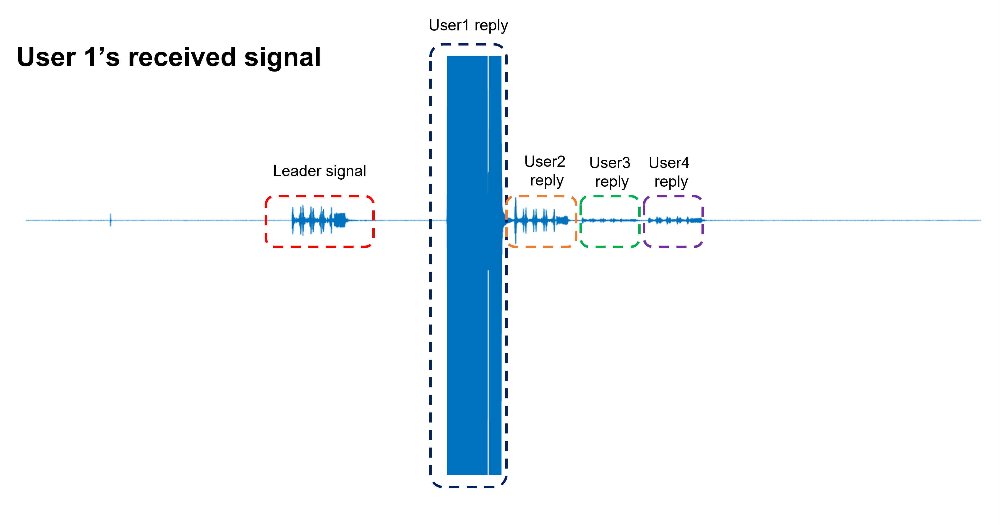
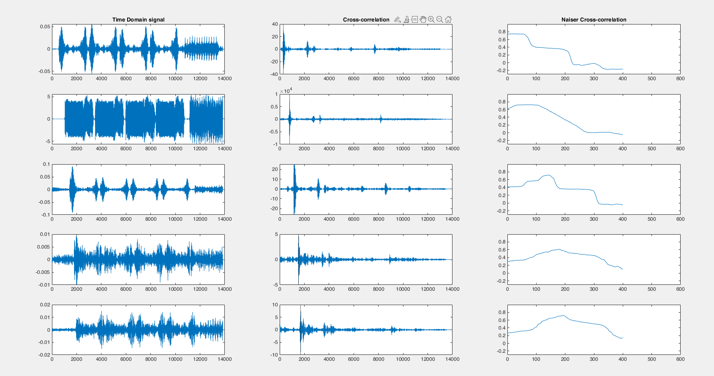
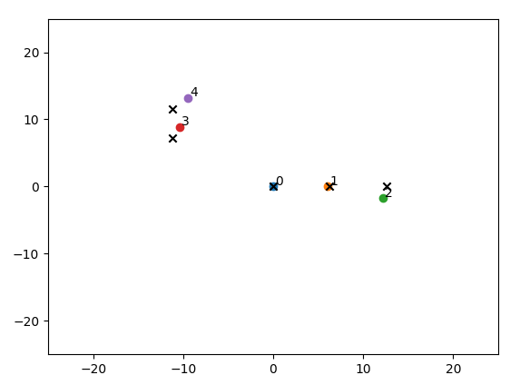
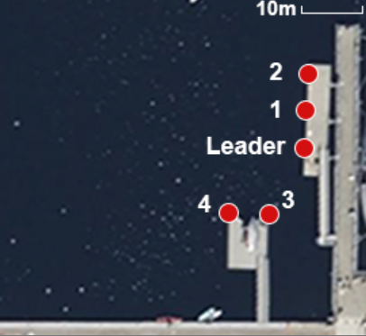

# Offline process
This is for the offline processing of the data collected using the Android App.

## Matlab_Pairwise_Range
The pairwise 1D ranging algorithm using dual-mic channel estimation. The Matlab version we use is MATLAB R2021B.

### main.m
It is the main function to run our pairwise 1D ranging system on the. The estimated 1D ranging matrix will be saved on "./data_example/1/result*.txt". 
For each device, it should try to compute the arrival index of all signals. The below figures are an example of the received signal in the user1's microphones. 

### coarse_sync_group.m
This is the function to do preamble detection and coarse estimation. Specifically, it first applies the cross-correlation on the received signals and then applies the auto-correlation (Naiser correlation) to detect whether the signal is an actual preamble or some spiking noise. Finally, it returns the coarse indexes of signals.
The result coarse index will be shown in the figure:

### fine_sync_recv_single.m
This function uses the coarse index from **coarse_sync_group** to chunk the signal and apply dual-mic channel estimation of the beginning index of each preamble. Finally, it returns the fine-grained estimation of the indexes of signals. The dual-mic channel estimation results will be saved in the "./Matlab_Pairwise_Range/results". One example is shown as below. 

Each subplot is the channel estimation for each preamble in the received mic. The horizontal lines are the noise level with some additional safe intervals. The red cross is the highest peak and the black circle is the dual-mic selected direct path. 

### dual_mic_direct_path.m
The implementation of the dual-mic channel estimation algorithm in **fine_sync_recv_single**.

### naiser_corr3.m
The implementation of auto-correlation (Naiser correlation) in **coarse_sync_group**.
### multi_users_FSK3
It is the folder to save the raw sending signals.

### results
It is the folder to save the debugging image during the algorithm

## Python_3D_localization
### loc_depth.py
This is the main script to infer the 2D positions of the distributed devices based on the estimated pairwise 1D ranging matrix. The gt.txt contains the ground-truth of 3D positions which is measured by the measurement tape on the ground. (Note: the ground-truth depth is also measured, and we used this measured depth to project pairwise 1D ranging matrix to 2D plane, and then apply the SMACOF).
This will visualize the estimation of and output the 2D localization errors. The black cross symbols are the ground-truth and the colored circle is our estimation of 2D topology. 

### Weighted_SMACOF.py
This is the implementation of SMACOF algorithm to infer the 2D topology of a network from the pairwise 1D ranging with some position-known anchors.

## data_example
One data sample we collected in a deep harbor (~9-10m depth). The configuration for measurement is shown as below:

