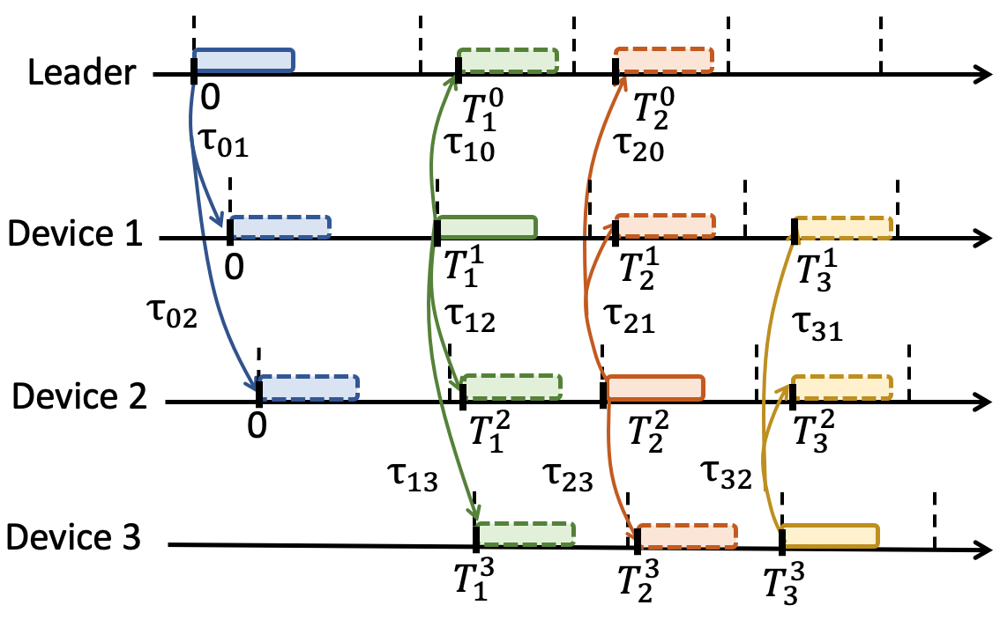
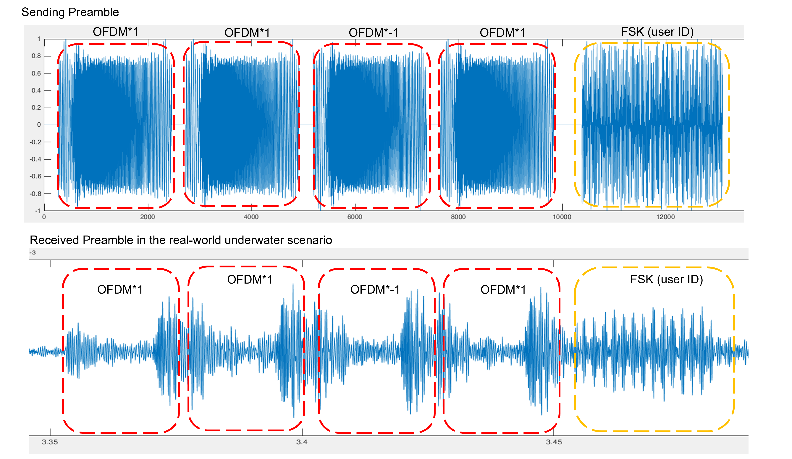

# underwatergps

## Android_Project
### Distributed protocol
This is the code for Android part to implement our distributed localization protocol. 
The distributed pipeline is shown as follows, 

Now the code can support a group maximum of 6 people. One of the devices serves as a leader, and the remaining devices serve as users with pre-assigned IDs. 
The basic protocol of the devices is the Time-Duplex Division.  After the leader broadcast a preamble to all the users, the users will reply a preamble after a certain time interval based on their ID to avoid packet collision. 

### Preamble design
The preamble is composed of 4 OFDM symbols modulated with CAZAC code, and followed by a FSK symbol to encode the user ID.

### Packet drop/Out of leader's range
Our distributed protocol is robust to the issues like Packet Drop and  Out of the Leader's range. Specifically, even though one device cannot receive the leader's preamble and it can still send the preamble based on other devices' reply signal and recover Time-Duplex Division protocol.

## Offline process

### Matlab_Pairwise_Range
The pairwise 1D ranging algorithm using dual-mic channel estimation

### Python_3D_localization
The Python code for 3D localization of divers using SMACOF algorithm with outlier detection
